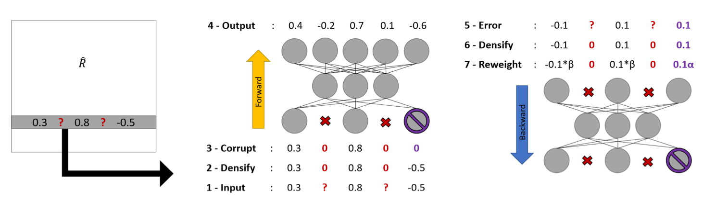
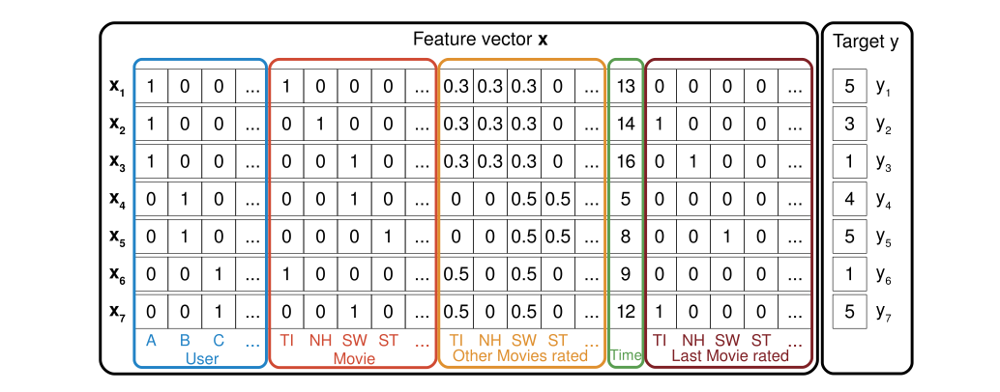

# A Practical Comparison of Denoising Autoencoder and Factorization Machine for Recommending Movies
CS420 Coursework: Recommender System

## Abstract
In this coursework, the author implemented and compared two most successful models for Recommender System: Denoising Autoencoder (DAE) and Factorization Machine (FM). Although the DAE is a powerful unsupervised deep learning method to recover corrupted data, on the specific recommender system task it is still less powerful than traditional method such as the FM, because of the high sparsity of data and poor compatibility with side information.

## Methodologies
### Item-Based Denoising Autoencoder

### Factorization Machine

Please view [my report](report.pdf) for details.